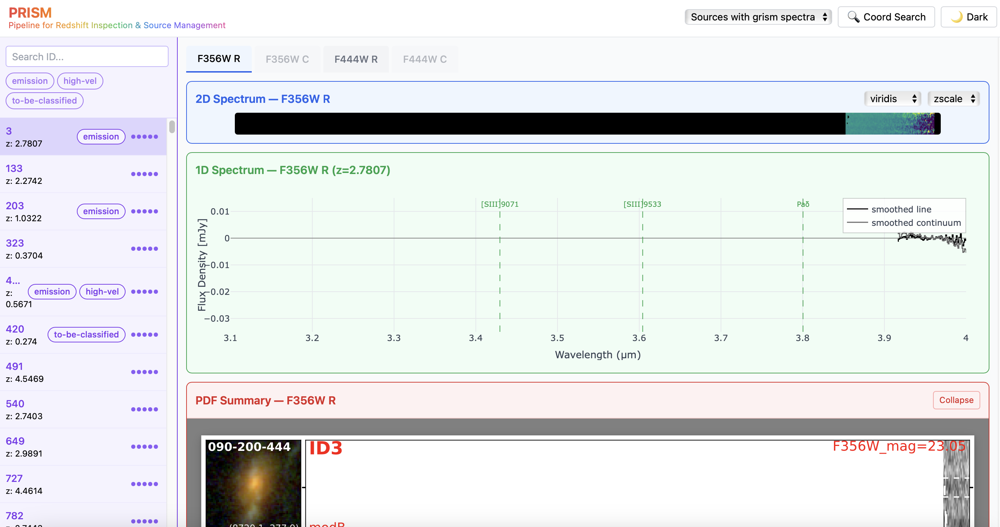
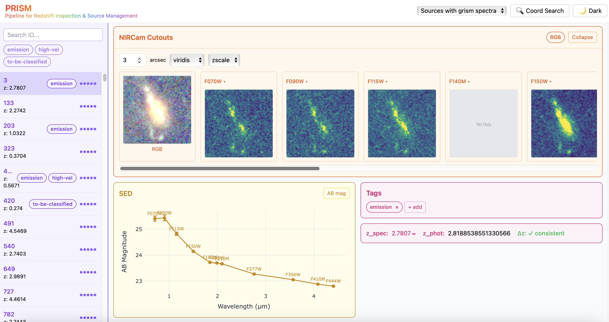

# PRISM — Pipeline for Redshift Inspection & Source Management

An interactive web application for inspecting 2D grism spectra, 1D spectra, and multi-band NIRCam images. Helps classify astronomical sources.

## Features

- Interactive 2D/1D spectrum visualization with multiple colormaps and scaling options
- NIRCam cutout viewer with multi-band support
- Spectral Energy Distribution (SED) plotting
- Source tagging and classification system
- Redshift comparison (spectroscopic vs photometric)
- Coordinate-based source search

## Screenshots

### Spectrum View



### Cutouts & SED View



## Installation

### Prerequisites

- Python 3.8+
- Node.js 16+ and npm
- Git

### 1. Clone the Repository

```bash
git clone https://github.com/LilyHanZhang/PRISM-Pipeline-for-Redshift-Inspection-Source-Management-.git
cd PRISM-Pipeline-for-Redshift-Inspection-Source-Management-
```

### 2. Install Dependencies

**Backend (Python):**
```bash
pip install -r requirements.txt
```

**Frontend (Node.js):**

If npm is not installed:
```bash
# Ubuntu/Debian
sudo apt install nodejs npm

# Or using conda
conda install -c conda-forge nodejs
```

Then install frontend dependencies:
```bash
cd frontend
npm install
cd ..
```

## Data Directory Setup

The application requires a data directory containing FITS catalogs, spectra, and NIRCam images. The directory structure should be:

```
<DATA_ROOT>/
├── sapphires_edr_spec_cat.fits      # Spectroscopic catalog
├── sapphires_edr_phot_cat.fits      # Photometric catalog
├── sapphires_edr_1d_spec/           # 1D spectra FITS files
├── sapphires_edr_2d_spec/           # 2D spectra FITS files
├── sapphires_edr_nircam_sci/        # NIRCam mosaic FITS files
└── sapphires_edr_spec_pdf/          # Pre-rendered PDF summary sheets
```

### Set the Data Path

**Option 1: Environment variable (recommended)**

Add to your shell profile (`~/.bashrc`, `~/.bash_profile`, or `~/.zshrc`):
```bash
export PRISM_DATA_ROOT=/path/to/your/data
```

Then reload:
```bash
source ~/.bashrc
```

**Option 2: Set before each run**
```bash
export PRISM_DATA_ROOT=/path/to/your/data
```

## Deployment

### Local Development

```bash
# Terminal 1: Start backend (with auto-reload)
uvicorn backend.main:app --reload --port 8000

# Terminal 2: Start frontend dev server
cd frontend
npm run dev
# → http://localhost:5173 (proxies API to localhost:8000)
```

### Production Server

```bash
# 1. Build frontend static files
cd frontend && npm run build && cd ..

# 2. Start server (listens on all interfaces)
uvicorn backend.main:app --host 0.0.0.0 --port 8000
```

Access at `http://<server-ip>:8000`

### Run in Background

```bash
nohup uvicorn backend.main:app --host 0.0.0.0 --port 8000 > prism.log 2>&1 &

# View logs
tail -f prism.log

# Stop server
pkill -f uvicorn
```

### Quick Start Script

```bash
# Uses run.sh (sets default data path if not configured)
./run.sh
```

## Updating

```bash
# Pull latest code
git pull

# Rebuild frontend
cd frontend && npm run build && cd ..

# Restart server
pkill -f uvicorn
uvicorn backend.main:app --host 0.0.0.0 --port 8000
```

## Configuration

Key environment variables:

| Variable | Description | Default |
|----------|-------------|---------|
| `PRISM_DATA_ROOT` | Path to data directory | `../data` |
| `PRISM_FIELD_NAME` | Field name for file matching | `M0416` |
| `PRISM_PASSWORD` | Enable HTTP Basic Auth | (disabled) |

See `backend/config.py` for all configuration options.

## Project Structure

```
├── backend/                 # FastAPI backend
│   ├── main.py             # Application entry point
│   ├── config.py           # Configuration
│   ├── state.py            # State management
│   ├── routers/            # API routes
│   └── utils/              # Utility functions
├── frontend/               # React frontend
│   ├── src/
│   │   ├── components/     # React components
│   │   └── utils/          # API utilities
│   └── package.json
├── tests/                  # Unit tests
├── requirements.txt        # Python dependencies
└── run.sh                  # Quick start script
```

## License

MIT
